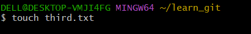
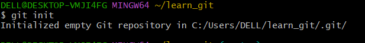
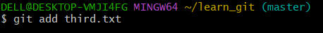
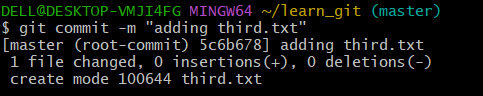
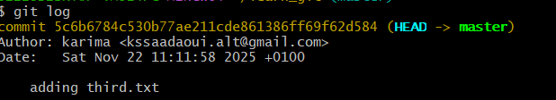
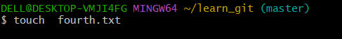
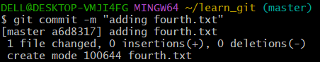
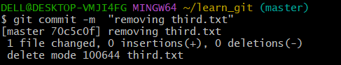
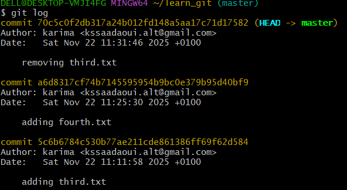
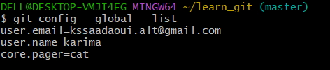

mkdir learn_git  # Cette commande crée un nouveau dossier nommé " learn_git "

cd learn_git   # cd = change directory → permet d’entrer dans le dossier "learn_git"

touch third.tx  # Crée un nouveau fichier vide nommé "third.tx"

git init   # Initialise un nouveau dépôt Git vide dans le dossier courant

 
git add third.txt   # Ajoute le fichier third.txt à la staging area

git commit -m "adding third.txt"   # Crée un commit avec le message "adding third.txt"

git log   # Affiche l’historique des commits, dont votre dernier commit

touch fourth.txt # Crée un nouveau fichier vide nommé "fourth.txt"

git add fourth.txt   # Ajoute le fichier fourth.txt à la staging area

git commit -m "adding fourth.txt"   # Crée un commit avec le message "adding fourth.txt"

git rm third.txt   # Supprime le fichier third.txt et l’ajoute à la staging area pour suppression

git add .   # Ajoute toutes les modifications (fichiers ajoutés, modifiés ou supprimés) à la staging area

git commit -m "adding fourth.txt"   # Crée un commit avec le message  "adding fourth.txt"

git log   # Affiche l’historique des commits, dont votre dernier commit

git config --global core.pager cat   # Configure Git pour afficher toute la sortie sans pagination

git config --global --list   # Affiche toutes les configurations Git globales de l’utilisateur

